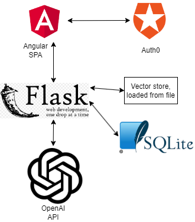

# Secure programming assistant

The application is a secure programming assistant that helps users to create secure applications. Logged in users can chat with the assitant which is using GPT-3.5 and using documents scraped from owasp.org as potential retrieved content to give user's up to date information on secure programming practices.

Main features of the application

- Retrieval augmented Chatbot
- Continuing or deleting previous conversations
- Rate limiting for non-admin users
- User authentication (user management is handled by auth0 service)
- Slick UI

## Structure of the program



Available api endpoints:

- GET /chats - load list of all previous conversations of the user, only shows the first message of each conversation
- GET /chats/{chat_id} - load a specific conversation
- POST /chats/ - start a new conversation by sending initial message
- POST /chats/{chat_id} - continue a conversation by sending a new message
- DELETE /chats/{chat_id} - delete a conversation
- GET /ping - check if the server is running

Every route requires a valid access token in the Authorization header. The access token is obtained by logging in with auth0.

Structure of the repository:

- secure-programming-assistant-ui/ - contains the Angular application
- api/db - contains database schema and utility functions
- api/langchain_utils - defines the chatbot, connects to OpenAI API and retrieves relevant documents from vector store
- api/notebooks - has a notebook for creating the vector store
- api/vector_store - optional vector store which is loaded to memory when the application starts
- api/\_\_init\_\_.py - initializes the Flask application
- api/authenticate.py - contains the authentication logic
- api/core.py - contains rate limiting logic
- api/llm.py - contains the endpoints

## Secure programming solutions

- Follows Oauth2.0 protocol.
- Access control is implemented by requiring a valid access token in the Authorization header. The JWT token uses RS256 algorithm for signing and the public key is obtained from auth0. The token is verified in api/authenticate.py. All routes require a valid token except for the /ping route and user data is only accessed using the user_id from the token. In addition the admin role is accessed from the token and used to determine if the user is an admin.
- Allowed CORS origins are set to the frontend domain in the Flask application.
- All login and registration attempts are logged by Auth0.
- Api is rate limited by ip to 4 requestes per second and chat prompt api is further limited to 50 per hour or 100 per day to non admin users. In Auth0 threat protection is prevent access to bots and other malicious actors.
- Server does not store any session identifiers or cookies.
- Sql queries have parameterized user and llm inputs.
- Chat is sanitized with ngx-markdown to prevent xss attacks.
- Dependencies were last checked 13.4.2024, they are up to date and no vulnerabilities were found were found in production dependencies. Vulnerability checks were done with npm audit and https://pypi.org/project/safety/ library.
- Simple user prompt validation and chat history and retrieved documents are truncated to prevent exceeding LLM context window.

## Setup

Auth0:
Create a new application, set the application type to Regular Web Application. Configure Allowed Callback URLs, Allowed Logout URLs and Allowed Web Origins to the frontend domain. Set the RS256 signing algorithm. Create a new API and set the Identifier to the API audience.
Create an admin role and assign it to the admin user. Then add custom claims to accessToken with custom action in login flow. For example:

```javascript
exports.onExecutePostLogin = async (event, api) => {
  const namespace = "https://my-app.example.com";
  if (event.authorization) {
    api.accessToken.setCustomClaim(
      `${namespace}/roles`,
      event.authorization.roles
    );
    api.idToken.setCustomClaim(`${namespace}/roles`, event.authorization.roles);
  }
};
```

Then enable Attack protection settings such as brute force protection and other settings.

UI:

In environment.ts set the auth0 configuration and the api url.
Then run:

```bash
npm install
ng serve
```

API:

install the requirements from requirements.txt
Set the environment variables in .env file.
AUTH0_DOMAIN=#auth0 domain
AUTH0_AUDIENCE=#auth0 audience
AUTH_NAMESPACE=#auth0 namespace
OPENAI_API_KEY=#openai api key

initialize the database with:

```bash
flask --app api init-db
```

Run the application with:

```bash
flask --app api run # optional --debug
```

Creating vector store (optional):
Collect documents from owasp.org or another source and save them in csv format (or any other format with supported loaders). Then run the notebook in api/notebooks to create the vector store.

## Testing

Unit testing

Flask application is tested with pytest. Run the tests in api folder by running:

```bash
pytest
```

Unit tests use token pair located in api/tests/test_keys.
In addition LLM calling is mocked in the tests.
Unit tests cover the core functionality of the application, authentication, rate limiting and and injection prevention.

### Manual security testing:

1.  Expected: Login and wait for 30 minutes. Try to access the application again. The session should be expired and the user should be redirected to the login page.
    Result:

-

2.  Expected: Application can't be accessed After logout. Ensure that routes other than dashboard, and api can't be accesed after logout
    Result:

-

3. Expected: Ensure that all buttons, links and inputs are working as expected.
   Result: -

4. Expected: Error handling is working. Send a request with a missing parameter. The server should return a 400 status code. Make sure error response is sent if prompt fails.
   Result: -

5. Expected: Injection prevention is working. Send a request with a malicious prompt, or malicious chatId, behavoir should be same as with any other input.
   Result: -

6. Expected: XSS prevention is working. The script should not be executed in the browser.
   Result: TODO: - simple alert, inline script, onpointerevent, url parameters
   https://portswigger.net/web-security/cross-site-scripting/cheat-sheet

7. Expected: CSRF prevention is working. Attempt to send requests from another domain. The server should return a 403 status code.
   Result: -

8. Expected: Prompts are validated. Send a request with a prompt that is too long. The server should return a 400 status code. Also try different prompt injections.
   Result: -

9. Expected: Try to make LLM generate a malicious link, which sends chat messages to a different server. This should not be possible.
   Result: -

## Known security issues or vulnerabilities

Email verification is not implemented as it is not available in the auth0 free tier. This means that users can create accounts with fake email addresses. The issue is mitigated by enabling threat detection in auth0 which will block users with suspicious behavior.

MFA is not implemented.

Due to the chosen authentication solution, tokens are not revoked when a user logs out. This means that if a token is stolen, it can be used until it expires. This is mitigated by setting a short expiration time for the tokens.

It's possible that LLM generates malicious links.

## Future improvements

- Deploy the application
- Automated alerts for rate limiting and other security events.
- Logging of all requests and logging of UI errors.
- Improved sanitization of chat messages.
- CI/CD pipeline for the application.
- Streaming of the LLM responses.
- Generating representative titles for the conversations.
- Feature to publish and share conversations.
- Integration with tts and stt services.
- Support for multiple LLM models, preferrably local.
